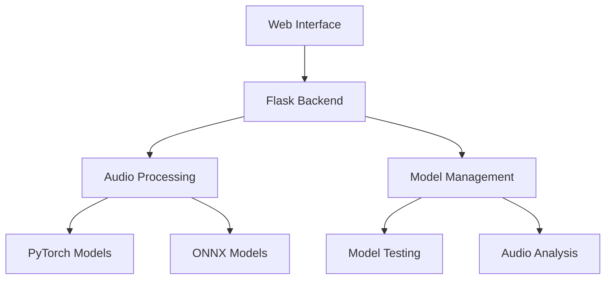
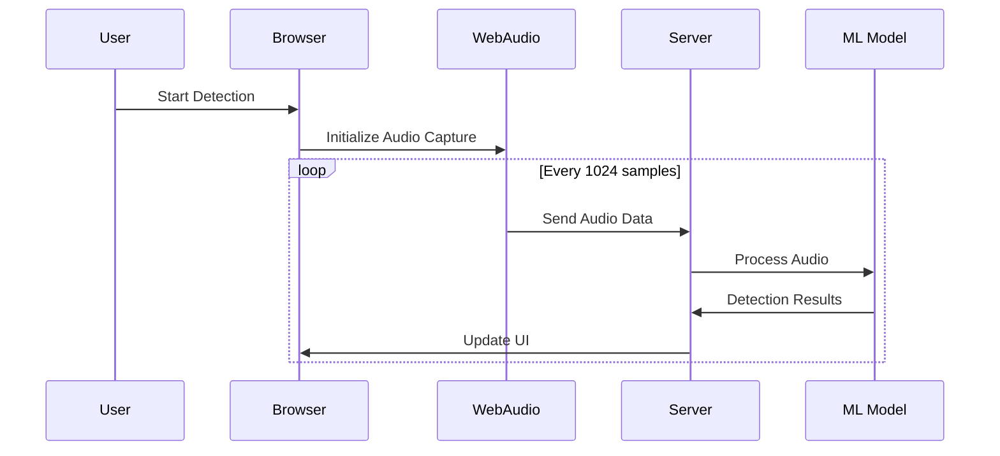
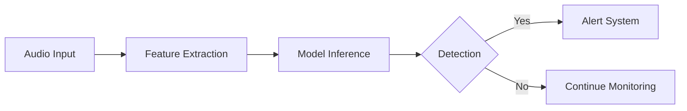
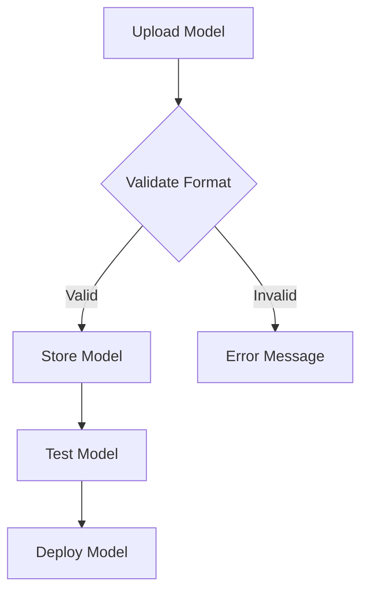

# 🎯 DroneSentinel - Drone Audio Detection System

> Developed by [KaizenApps.com](https://KaizenApps.com) for [KaizenLabs.uk](https://KaizenLabs.uk) and Satern R&D Labs

## 🌟 Overview

Project Uriel is a cutting-edge web-based drone detection system that uses audio processing and machine learning to identify and classify drone sounds in real-time. The system specializes in detecting FPV drones and Shahed-type drones through their unique acoustic signatures.


## 🎥 Demo


## 🔧 Technology Stack



- 🌐 Frontend:
  - Tailwind CSS for styling
  - Material UI Icons
  - WebSocket for real-time updates
  - Web Audio API for audio capture

- 🔙 Backend:
  - Flask + Flask-SocketIO
  - PyTorch for model inference
  - NumPy & SciPy for audio processing
  - SQLAlchemy for data management

## 🚀 Features

- 🎤 Real-time audio capture and processing
- 🤖 Multiple model support (ONNX, PyTorch)
- 📊 Live confidence scoring
- ⏱️ Uptime tracking
- 📝 System logging
- ⚙️ Admin interface for model management
- 🧪 Model testing capabilities

## 📱 Compatible Devices

The system works on any device with:
- A modern web browser (Firefox recommended for best audio visualization)
- Microphone access
- Internet connection

Tested platforms:
- 💻 Desktop (Firefox recommended, Chrome has limited visualization support)
- 📱 Mobile devices
- 🎯 Edge devices with microphone capabilities

> **Note**: For optimal audio visualization, we recommend using Firefox. You can download it [here](https://www.mozilla.org/firefox/new/). Chrome users may experience limited functionality with the spectrogram visualization.

## 🛠️ Installation

```bash
# Clone the repository
git clone https://github.com/kaizenlabs/project-uriel.git

# Install dependencies
pip install -r requirements.txt

# Start the application
python main.py
```

## 📊 Architecture



## 🎯 Use Cases

1. **Drone Detection**


2. **Model Management**


## 🎓 Model Training

### Using Teachable Machine
1. Visit [Teachable Machine](https://teachablemachine.withgoogle.com/train) and select the "Audio Project" option
2. Record background noise samples (minimum 20 seconds)
3. Create classes for different drone types
4. Record multiple samples for each drone type (minimum 8 samples)
5. Train the model
6. Export the model in your preferred format (TensorFlow.js, TensorFlow Lite, or Python)

### Upcoming Features
- [ ] Add example models for common drone types
- [ ] Improve real-time audio processing optimization
- [ ] Enhance statistics and visualization features

## 🌟 Major Inspirations

This project builds upon and improves the work from:
- [Acoustic Activity Recognition in JavaScript](https://dev.to/devdevcharlie/acoustic-activity-recognition-in-javascript-2go4)
- [Armaaruss Drone Detection](https://github.com/Armaaruss/Armaaruss.github.io)
- [CMU's Ubicoustics Project](http://www.gierad.com/assets/ubicoustics/ubicoustics.pdf)

Key improvements:
- Enhanced real-time processing
- Multiple model support
- Advanced admin interface
- Improved audio analysis algorithms
- Better user interface and feedback

## 📚 References

1. [Web Audio API Documentation](https://developer.mozilla.org/en-US/docs/Web/API/Web_Audio_API)
2. [Canvas API Documentation](https://developer.mozilla.org/en-US/docs/Web/API/Canvas_API)
3. [PyTorch Audio Processing](https://pytorch.org/audio/stable/index.html)
4. [Flask-SocketIO Documentation](https://flask-socketio.readthedocs.io/)
5. [Tailwind CSS](https://tailwindcss.com/)

## 📄 License

This project is licensed under the MIT License - see the [LICENSE.md](LICENSE.md) file for details.

## 🤝 Contributing

Contributions are welcome! Please read our [Contributing Guidelines](CONTRIBUTING.md) for details on our code of conduct and the process for submitting pull requests.

## 📞 Contact

For support or queries:
- 📧 Email: support@kaizenlabs.uk
- 🌐 Website: https://kaizenlabs.uk

---

<p align="center">Made with ❤️ by KaizenApps.com</p>
